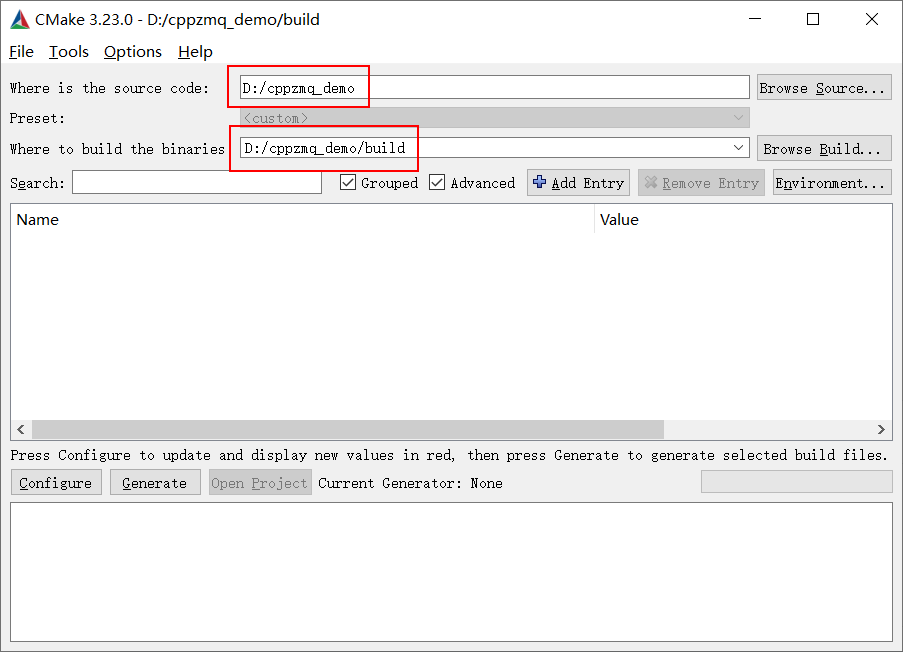
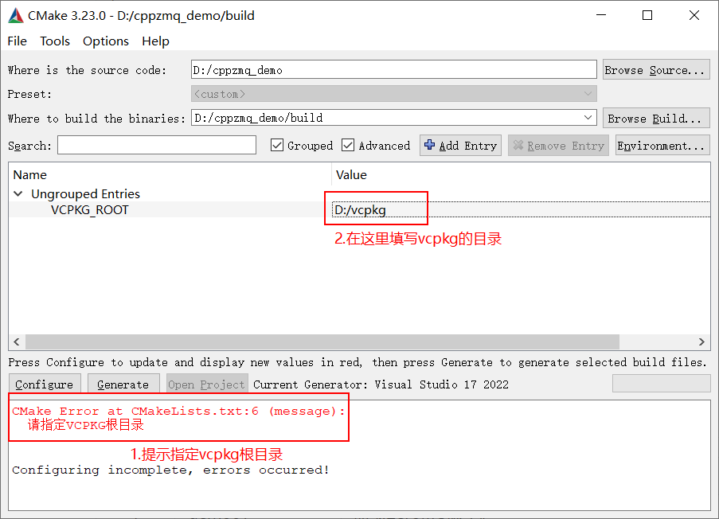

# ZeroMQ用法示例

## 概述

示例使用[cppzmq](https://github.com/zeromq/cppzmq)的接口编写，cppzmq是基于libzmq的封装的高级别API，它有如下特点：

1. cppzmq将libzmq的C语言API转化为C++接口，具有类型安全的优点，并且更利于资源管理；
2. 轻量。使用cppzmq仅需包含头文件zmq.hpp（有时可能需要zmq_addon.hpp）；
3. zmq.hpp主要是对libzmq的C接口进行直接映射，zmq_addon.hpp提供额外更高级别的抽象。

工程中提供了ZMQ常用的消息模式示例，代码简明直观，方便开发者学习和使用。

## 环境要求

- 构建工具：CMake，版本大于等于3.10.0
- 编译工具：Visual Studio 2015及以上，需要C++11环境

**依赖库：**

- cppzmq（通过vcpkg安装，会同时安装libzmq库）

  ```
  vcpkg install cppzmq:x64-windows
  ```

- Qt5（可选）

## 代码结构

```
cppzmq_demo
│
├────src『源码』
|     |
|     ├───demo01『示例1』
|     ├───demo02『示例2』
|     └───......『其它示例』
|
├────docs『ZMQ相关文档』
|
└────README.md『使用说明』
```

## 编译指南

首先用CMake来构建工程：



构建过程中会提示，需要指定vcpkg的目录。

接下来填写vcpkg的根目录：



最后正常构建、编译即可。

## 示例说明

| 序号 | 示例名称    | 示例简介                                                     |
| :--: | ----------- | ------------------------------------------------------------ |
|  1   | demo01      | 获取ZeroMQ版本                                               |
|  2   | demo02      | Requset Reply，请求-响应模式                                 |
|  3   | demo03      | Requset Reply，请求-响应模式，示例中说明了可以发出多个请求   |
|  4   | demo04      | Exclusive Pair，互斥对模式                                   |
|  5   | demo05      | Pull Push，推拉/管道模式                                     |
|  6   | demo06      | Publish Subscribe，发布-订阅模式                             |
|  7   | demo07      | Publish Subscribe Proxy，发布-订阅模式中加入代理             |
|  8   | demo08      | Dealer Router                                                |
|  9   | demo_inproc | 通过inproc的方式进行节点连接                                 |
|  10  | demo_json   | 使用ZeroMQ发送和接收json数据的示例，该示例使用QJson，依赖Qt库 |
|  11  | demo_pollin | 多个socket进行轮询                                           |

### demo_pollin

Server：服务器

Client1：客户端示例1，可能会造成消息阻塞

Client2：客户端示例2，接收使用dontwait标识，会占用CPU

Client3：客户端示例3，添加1ms延迟，虽然不占用CPU了，但用法不够优雅

Client：正确的客户端示例，使用轮询

### demo_protobuf

首先编写proto文件，然后生成C++代码：

```
protoc.exe --cpp_out=. info.proto
```

