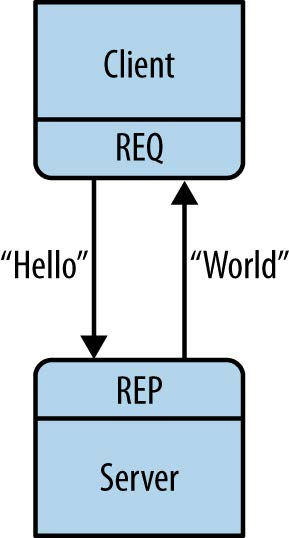
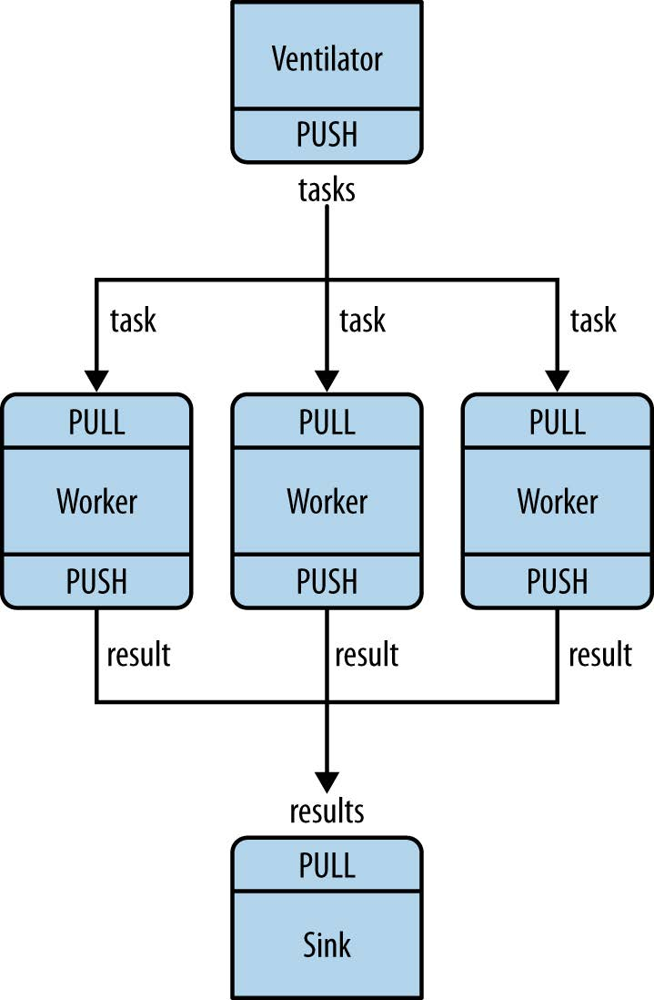
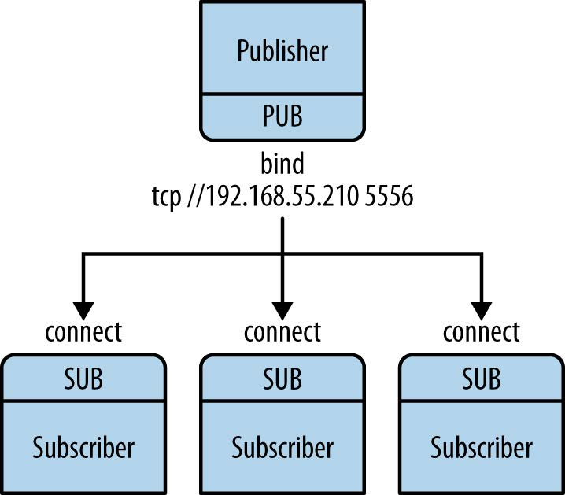
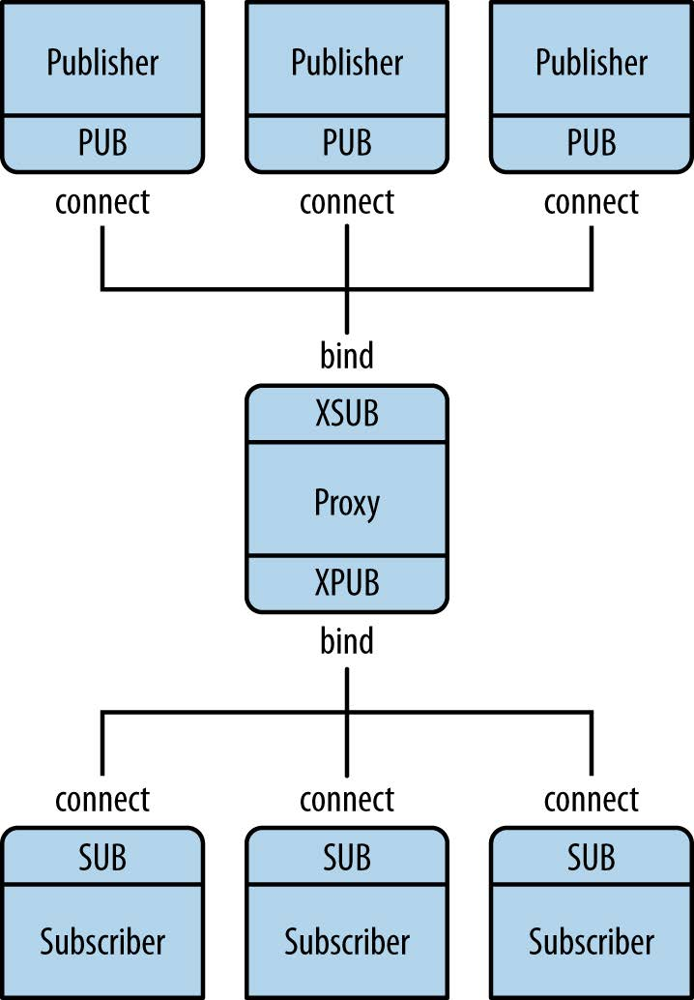

# ZeroMQ

## 介绍

- ZMQ（也称为ØMQ、ZeroMQ 或 0MQ）是一种高性能的异步消息传递库，看起来像是一套嵌入式的网络链接库，但工作起来更像是一个并发式的框架，旨在用于分布式或者并发应用程序中。它提供了一个消息队列，但是与面向消息的中间件不同，ZMQ系统可以在没有专用消息代理的情况下运行。 
- ZMQ提供的套接字可以在多种协议中传输消息，如线程间、进程间、TCP、广播等。你可以使用套接字构建多对多的连接模式，如扇出、发布-订阅、任务分发、请求-应答等。
- ZMQ的快速足以胜任集群应用产品。它的异步I/O机制让你能够构建多核应用程序，完成异步消息处理任务。ZMQ有着多语言支持，并能在几乎所有的操作系统上运行。ZMQ是[iMatix](http://www.imatix.com/)公司的产品，以LGPL开源协议发布。
- ZMQ的理念从零开始。零表示零代理（ZeroMQ是无代理），零延迟，零成本（免费）和零管理。
- 更广泛地说，“零”是指渗透到项目中的极简主义文化。我们通过消除复杂性而不是通过公开新功能来增加功能。

## 为什么用ZMQ

- 调用的socket接口较多。
- TCP有时局限于一对一的连接。
- 编程需要关注很多socket细节问题。
- 不支持跨平台编程。
- 需要自行处理分包、组包问题。
- 流式传输时需处理粘包、半包问题。
- 需自行处理网络异常，比如连接异常中断、重连等。
- 服务端和客户端启动有先后。
- 自行处理IO模型。
- 自行实现消息的缓存。
- 自行实现对消息的加密。

## 开发环境准备

### 安装

建议通过vcpkg安装。

vcpkg是一个库管理工具，先从github上获取[vcpkg](https://github.com/microsoft/vcpkg)，然后进入vcpkg的目录并执行 bootstrap.bat 脚本。

```bash
> git clone https://github.com/microsoft/vcpkg
> bootstrap-vcpkg.bat
```

准备好vcpkg之后，可以通过它的命令来安装你需要的库：

```
> vcpkg install [packages to install]
```

我们一般不直接使用zmq的底层库，因为它的API复杂，使用时易出错。zmq的高级别API有czmq、cppzmq等，这里我们选择基于C++封装的cppzmq。

```
> vcpkg install cppzmq:x64-windows
```

### CMake

安装完成之后，就可以使用CMake来组织工程了。

在工程中，首先引入vcpkg，将`CMAKE_TOOLCHAIN_FILE`指定为**vcpkg.cmake**文件的路径。

```cmake
set(CMAKE_TOOLCHAIN_FILE "your/path/to/vcpkg/scripts/buildsystems/vcpkg.cmake")
```

> 注意：必须在CMake中的`project`语句之前设置，否则不会生效。

接下来引入cppzmq：

```cmake
find_package(cppzmq CONFIG REQUIRED)
```

下面给出一个完整的CMake参考：

```cmake
cmake_minimum_required(VERSION 3.10.0)

set(VCPKG_ROOT "" CACHE PATH "")
if(NOT EXISTS ${VCPKG_ROOT}/.vcpkg-root)
	message(FATAL_ERROR "请指定VCPKG根目录")
endif()
set(CMAKE_TOOLCHAIN_FILE "${VCPKG_ROOT}/scripts/buildsystems/vcpkg.cmake")

project(ZMQDemo)

find_package(czmq CONFIG REQUIRED)

add_executable(
	${PROJECT_NAME}
	main.cpp
)

target_link_libraries(
	${PROJECT_NAME}
	cppzmq
)
```

## 基础知识

### socket

ZMQ的节点间建立连接有两种方式：绑定bind和连接connect，bind的节点是服务器，connect的节点是客户端。

很多架构遵循客户端/服务器模型，服务器大多是静态的，客户端大多是动态的。通常服务器是对客户端可见的，反过来并不如此。我们可以根据这些特点来决定用bind还是connect。

ZMQ中的套接字通过传输地址进行连接，比如tcp、inproc、ipc等。

- tcp：TCP传输
- inproc：进程内/线程间传输，比tcp和ipc快很多。需注意的是，服务器和客户端的套接字必须使用同一上下文
- ipc：进程间传输，基于UNIX domain sockets，所以不支持Windows系统

tcp示例：

```cpp
zmq::context_t ctx;
zmq::socket_t clientSock(ctx, zmq::socket_type::req);
clientSock.connect("tcp://127.0.0.1:5555");
```

ipc示例：

```cpp
// 使用同一上下文
zmq::context_t ctx;

// 服务器
zmq::socket_t serverSock(ctx, zmq::socket_type::rep);
serverSock.bind("inproc://example");

// ...

// 客户端
zmq::socket_t clientSock(ctx, zmq::socket_type::req);
clientSock.connect("inproc://example");
```

### message

ZMQ中的数据是以消息的形式发送和接收的。

示例：

```cpp
zmq::message_t topic(type);
sock.send(topic, zmq::send_flags::none);
```

ZMQ中有一个“more”的概念，允许我们同时发送/接收多条消息。

示例：

```cpp
// 发送端
zmq::message_t msg1, msg2;
auto res = sock.send(msg1, zmq::send_flags::sndmore);
res = sock.send(msg2, zmq::send_flags::none);

// 接收端
zmq::message_t msg1, msg2;
auto res = sock.recv(msg1, zmq::recv_flags::none);
if (!msg1.more()) {
    std::cout << "Oh dear, sheeps are going astray\n";
}
else {
    auto res = sock.recv(msg2, zmq::recv_flags::none);
}
```

## 消息传递模式

ZeroMQ的消息模式是通过一对类型相匹配的套接字实现的。

内置模式的有：

- Request-Reply：将一组客户端连接到一组服务器。这是一个远程过程调用和任务分发模式。
- Publish-Subscribe：将一组发布者连接到一组订阅者，是一种数据分布模式。
- Pipeline：以扇入/扇出方式连接各节点，是一个并行任务分发和收集的模式。
- Exclusive Pair：以互斥的方式连接两个套接字。

除此之外，还有很多可扩展的模式，下面将详细说明。

### Request Reply



**请求-应答**模式：客户端将消息发送到服务器，服务器接收到消息后进行应答，最后客户端收到服务器的应答。

请求-应答的会话是严格同步的，客户端首先发消息，然后再接收，如此循环。如果打乱了这个顺序，比如连续发送两次请求，则会报错。类似地，服务器必须先接收再应答，不能直接向客户端发消息。

- 多个REQ套接字可以向同一个REP套接字发出请求；
- 如果没有可用的服务，则套接字上的任何发送操作都应阻塞，直到至少有一项服务可用为止。`REQ`套接字不会丢弃消息；
- 如果`REQ`套接字不再存在，则答复将被静默丢弃。

### Exclusive Pair

**互斥Pair**模式：不同于请求-应答模式，互斥Pair模式是**异步**的，客户端向服务器发出请求，不需要等待。

Pair拒绝多个连接，两个连接组成的对是独占的：

- 在请求-答复模式下，启动多个客户端，每个客户端都能发送消息收到答复
- 在互斥Pair模式下，启动多个客户端，只有第一次启动的那个能发送消息

### Push Pull



**推拉**模式：也叫管道模式，相当于任务的分发和收集。

推拉模式采用分而治之的思想，它是一个并行处理的模型：

1. 首先产生可以并行执行的任务，并Push出去；
2. 一组工人Pull下任务并进行处理；
3. 如果有必要，可以有一个接收器来收集结果。

Push与Pull可以一对多，也可以多对一。

- 在一对多的情况下，Push套接字将任务均匀地分配给工人，这就是所谓的负载均衡；
- 在多对一的情况下，Pull套接字均匀地收集结果，这就是所谓的公平排队。

这种模式下数据是**单向**的，Push套接字无法接收数据。

### Publish Subscribe



**发布-订阅**模式：这种模式下的数据是**单向**的，服务器发布一些带有主题的消息，客户端可以订阅主题收到与该主题相关的消息。

注意：在使用时一定要订阅主题，如果不订阅主题，则不会收到任何消息。

- 主题通常是一个字符串；
- 如果订阅空字符串主题，则会收到服务器发出的所有消息；
- 可订阅多个主题，客户端会收到这些主题相关的消息；
- 运行中可随时对主题进行订阅/取消订阅。

缺点：如果先打开Sub，后打开Pub并发送消息，Sub会丢失一些消息。因为在建立连接需要时间，这段时间内发送的消息会丢失。

解决办法：

1. 让Pub延迟一段时间再发送消息（不建议）
2. 让发布者和订阅者同步。

### Publish Subscribe Proxy



当网络变得足够大，如果直接在发布者与订阅者进行连接，则会出现非常复杂的星型结构，配置复杂且不易维护。

这时我们可以在中间设置代理，通过代理进行消息转发。

### Dealer Router

Dealer像是一个异步的Request套接字；

Router像是一个异步的Reply套接字。

Router套接字为它的每个连接分配一个默认的标识符。

----

## 拓展

### 轮询

多个socket时使用。

### 发送JSON数据

转成二进制。

### 发送protobuf数据

相比于json等其它格式，protobuf占空间更小。

## 附录

### 关于czmq和cppzmq

公司之前项目中用的是czmq，并且有一个经过封装的库，但其代码艰涩难懂，发现错误不易解决。所以推荐使用基于C++的cppzmq，它们的底层都是libzmq，但接口更好用：

1. czmq引入一个叫actor的跟线程和管道有关的东西，不易理解和使用
2. czmq将libzmq中的上下文隐藏起来了，如果不使用它自身提供的线程，程序会崩溃
3. 使用czmq很容易忘记指针释放，要看它的函数注释告诉你用完要释放
4. cppzmq在libzmq基础上封装，是纯头文件的，基于类，更易于C++开发者使用

### 书籍推荐

《ZeroMQ 云时代极速消息通信库》

### 其它说明

公司有一套基于czmq封装的例子，并且在项目中使用过。
